<h1 align="center">
  
  Bentiviz
</h1>

  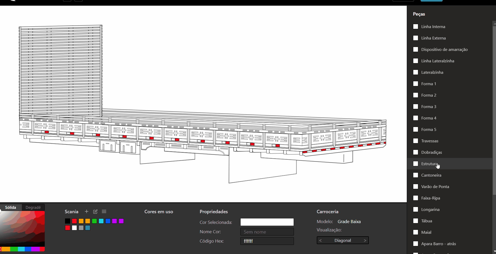

> **Sistema desktop offline-first para personalização e gerenciamento de pinturas industriais de carrocerias.**

---

### 🛡️ Nota de Privacidade

O código-fonte deste projeto é restrito e não está disponível publicamente por se tratar de uma solução desenvolvida especificamente para uso operacional interno da fábrica **Carga Pesada**. Todos os dados de clientes (como CPFs, nomes e telefones) exibidos nas imagens e vídeos de demonstração são fictícios e foram gerados aleatoriamente apenas para fins de ilustração.

---

## 🏭 Cenário

A fábrica de carrocerias **Carga Pesada**, localizada em Guarapuava-PR, opera desde 1975 produzindo carrocerias personalizadas para caminhões. No processo de fabricação, a etapa da pintura é um desafio operacional, pois cada projeto possui dezenas de componentes pintados individualmente.

Com uma equipe de 12 especialistas, a produção mensal da empresa é de aproximadamente 8 unidades (somando novas e reformas). O ciclo de produção completo leva cerca de 2 semanas, sendo que a etapa de pintura ocupa metade desse tempo (uma semana).

- **Estrutura da Carroceria:** Modelos como Grade Baixa, Graneleira e Boiadeira são formados por dezenas de itens individuais, desde peças estruturais (longarinas, travessas) até detalhes de acabamento (ripas, dobradiças, varões).
- **Customização Individual:** Cada um desses componentes é pintado de forma independente, seguindo as cores escolhidas pelo cliente para cada projeto específico.
- **Gargalo de Produção:** O fato de o ciclo de pintura consumir 50% do tempo total de fabricação torna a precisão na definição das cores um fator crítico para o cumprimento do prazo de entrega.

 

  
   
  

---

## ⚠️ O Problema: A "Falha de Comunicação"

Antes da implementação do sistema, a definição das cores para cada projeto era feita de forma manual, o que dificultava a clareza e a padronização das informações.

- **Ausência de Referência Visual:** O cliente dependia da própria imaginação ou de fotos de projetos passados, sem uma prévia fiel do seu próprio pedido.
- **Riscos Operacionais:** As especificações eram registradas em papel, gerando riscos de perda de dados e falhas de comunicação entre vendedores, clientes e o setor de pintura.
- **Impacto no Prazo:** Qualquer erro de interpretação nas cores ou especificações resultava em retrabalho, comprometendo o ciclo de produção de duas semanas.

 

  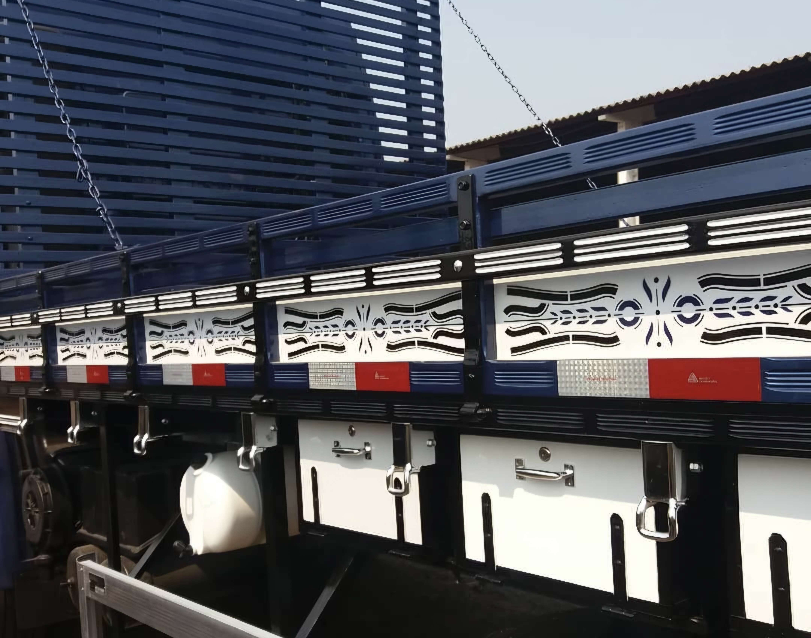
   
  <em>Legenda: Exemplo de um projeto real evidenciando a quantidade de componentes e a complexidade da pintura.</em>
  

---

## 💡 A Solução e Requisitos Técnicos

O **Bentiviz** foi desenvolvido para centralizar as especificações visuais e técnicas do processo de pintura. O sistema é utilizado pelos vendedores durante o atendimento: o funcionário opera a interface enquanto o cliente define suas preferências, permitindo a validação do projeto em tempo real antes do início da produção física.

O projeto foi guiado por requisitos específicos para o cotidiano da fábrica:

- **Visualização Dinâmica:** Permitir a validação das cores diretamente nos componentes da carroceria (ripas, dobradiças, longarinas) através de um modelo digital interativo.
- **Catálogo Digital:** Centralizar o histórico de pinturas para servir como portfólio e consulta rápida de projetos anteriores.
- **Ordens de Serviço:** Gerenciar as ordens de serviço, seus status e datas de entrega.
- **Eficiência Industrial:** Ser leve e otimizado para infraestrutura local, possuir interface intuitiva para uso no chão de fábrica e permitir a geração de relatórios (PDF) para guiar os pintores.

 

> **Nota sobre Fidelidade Cromática:** Como decisão de projeto, o software atua como uma ferramenta de referência visual. Devido às diferenças técnicas entre a representação de cor luz (RGB/Monitor) e cor pigmento (Tinta), o foco é a validação da configuração e harmonia das cores, e não a correspondência exata de escala laboratorial.

---

## 📄 Principais Funcionalidades

O Bentiviz entrega um conjunto de ferramentas focadas em produtividade e precisão técnica:

- **Visualização Interativa:** Permite a alteração dinâmica de cores em componentes vetoriais (SVG) com feedback visual instantâneo para o usuário.
- **Gerenciamento de Ordens de Serviço:** Fluxo completo para controle de status, prazos de entrega e rastreabilidade total por cliente.
- **Módulo Administrativo:** Interface dedicada para a importação de novos modelos de carroceria e gerenciamento centralizado de clientes e usuários.
- **Gestão de Paletas:** Organização de catálogos de cores customizáveis por marca ou categoria, facilitando a padronização das escolhas.
- **Controle de Acesso (RBAC):** Diferenciação de privilégios entre perfis de Administrador (gestão de dados mestre e configurações) e Usuário Comum (operação diária de vendas e pinturas).
- **Emissão de Relatórios Técnicos:** Geração automática de arquivos PDF contendo previews visuais da pintura e a listagem técnica de cores para guiar o setor de produção.
- **Disponibilidade Offline (Local-First):** Arquitetura projetada para funcionamento 100% independente de conexão com a internet, garantindo a resiliência no ambiente de fábrica.
    

|         Visualização e Pintura Dinâmica          |            Galeria e Gestão de Ordens            |
| :----------------------------------------------: | :----------------------------------------------: |
| 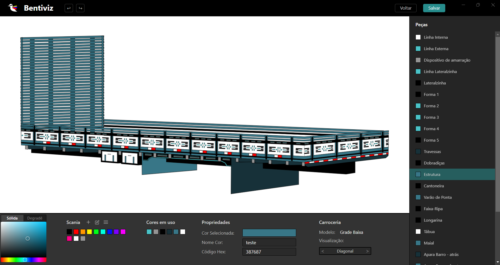 | 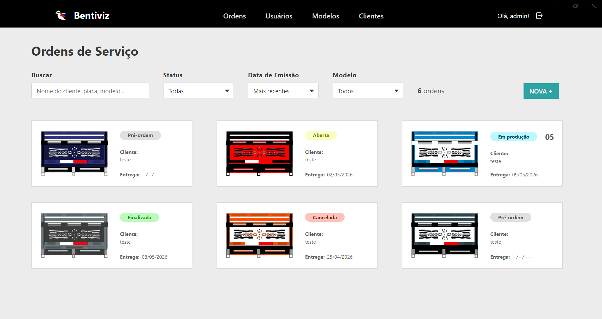 |

---

## 🛠️ Stack Tecnológica

Para garantir uma aplicação robusta, tipada e de alta performance em ambiente desktop, foram selecionadas as seguintes tecnologias:

- **Linguagem:** TypeScript
- **Frontend:** React, Vite, Fabric.js
- **Desktop Runtime:** Electron
- **Backend local:** Node.js com comunicação via IPC
- **Persistência:** SQLite utilizando Drizzle ORM
- **Design & Vetorização:** Figma (Prototipação de interface) e Inkscape (Desenho técnico)

 

  &nbsp;&nbsp;&nbsp;
  &nbsp;&nbsp;&nbsp;
  &nbsp;&nbsp;&nbsp;
  &nbsp;&nbsp;&nbsp;
  &nbsp;&nbsp;&nbsp;
  &nbsp;&nbsp;&nbsp;
  &nbsp;&nbsp;&nbsp;
  

 

---

<b>⚙️ Decisões Técnicas (Clique para expandir)</b>

 

As escolhas para o desenvolvimento do Bentiviz priorizaram a robustez em ambientes industriais, a integridade dos dados e a agilidade no desenvolvimento.

### Ecossistema Desktop (Electron & IPC)

A necessidade de operação offline e acesso direto ao sistema de arquivos local guiou a escolha pelo Electron:

- O uso de **IPC** (Inter-Process Communication) garantiu uma comunicação segura e performática entre o processo principal (Node.js) e a interface (React), permitindo a manipulação de dados locais sem depender de conexão externa.

### Engine de Visualização (Fabric.js & Inkscape)

A manipulação dinâmica de cores é o núcleo do sistema:

- **Inkscape:** Utilizado para a vetorização técnica das carrocerias. Cada componente foi desenhado individualmente com um ID único, permitindo que o software identifique e manipule partes específicas do SVG com precisão.
- **Fabric.js:** Biblioteca selecionada para renderizar e interagir com os desenhos. Através do mapeamento dos IDs, o Fabric.js aplica cores em tempo real, entregando feedback visual instantâneo para a validação do cliente.

### Persistência e Tipagem (SQLite, Drizzle & TypeScript)

Adotei uma arquitetura Local-first para garantir a disponibilidade operacional constante na fábrica:

- **Better SQLite3:** Pela velocidade e confiabilidade em ambientes desktop.
- **Drizzle ORM:** Assegura uma comunicação com o banco de dados de forma moderna e totalmente tipada.
- **TypeScript:** O uso de TypeScript em todo o projeto reduziu a incidência de erros em tempo de execução e facilita a manutenção da arquitetura a longo prazo.

### Interface e UX (React, Vite & Figma)

O desenvolvimento da interface foi focado em produtividade e clareza visual:

- **Figma:** Foi essencial para prototipar interfaces que atendessem à realidade dos funcionários, priorizando a clareza visual.
- **React aliado ao Vite:** Proporcionou um ciclo de desenvolvimento rápido através de componentes reutilizáveis e Hot Module Replacement (HMR).

### Ambiente de Desenvolvimento (VSCode e GitHub)

A organização do projeto seguiu padrões profissionais para garantir rastreabilidade:

- **VS Code:** Hub central de desenvolvimento, utilizando linting (ESLint/Prettier) para manter a qualidade e padronização do código.
- **GitHub:** Utilizado para controle de versão e gerenciamento do progresso das tarefas.

---

<b>📅 Processo de Desenvolvimento (Clique para expandir)</b>

 

O desenvolvimento do Bentiviz seguiu uma metodologia iterativa e incremental, focada na entrega de valor contínuo através de vertical slicing.

Diferente de uma abordagem linear, o projeto foi dividido em ciclos semanais onde cada funcionalidade era desenvolvida em todas as suas camadas: desde a modelagem no banco de dados e lógica de backend até a interface e comunicação IPC. Isso permitiu que o sistema tivesse telas completamente funcionais e testáveis desde os primeiros estágios do cronograma.

### Roadmap de Execução (Dez/2025 - Fev/2026)

- **Ciclo 1 (Dezembro): Definição e Base do Sistema**
  - Design de interface, definição da stack tecnológica e estruturação do ambiente.
  - Modelagem inicial do banco de dados e implementação do núcleo de segurança (Autenticação e CRUD de Usuários).
- **Ciclo 2 (Janeiro): Módulos Operacionais**
  - Desenvolvimento do motor de pintura interativa e gestão de paletas de cores.
  - Implementação do gerenciamento de clientes e persistência transacional de pinturas e ordens.
- **Ciclo 3 (Fevereiro): Consolidação e Artefatos**
  - Desenvolvimento da galeria de projetos e sistema de controle de status.
  - Criação de módulos de visualização detalhada e edição de ordens existentes.
  - Implementação final do motor de relatórios técnicos em PDF.

Essa abordagem assegurou a robustez da arquitetura, permitindo ajustes rápidos e garantindo que cada nova tela estivesse pronta para o uso real na fábrica assim que concluída.

---

## 🏗️ Modelagem de Dados e Arquitetura

Para suportar a complexidade da personalização das carrocerias e garantir a integridade das informações, a arquitetura do sistema foi planejada seguindo o Paradigma Orientado a Objetos. O diagrama de classes reflete uma estrutura normalizada, focada em flexibilidade e performance:

- **Abstração de Modelos:** A estrutura permite que um modelo de Carroceria possua múltiplas peças (Peça), cada uma vinculada a um identificador único no arquivo SVG. Essa relação é o que possibilita a interatividade direta entre o código e o design gráfico.
- **Gestão de Ordens:** A relação entre Cliente, Usuario, Status e Pintura com OrdemDeServico garante a rastreabilidade de cada projeto de pintura realizado na fábrica.
- **Flexibilidade Cromática (Desacoplamento):** Um ponto crucial da arquitetura é a separação entre as entidades CorPaleta e CorPintura:
  - **CorPaleta:** Funciona como um catálogo mestre de cores pré-definidas.
  - **CorPintura:** É uma instância única atrelada a uma pintura específica. Esse desacoplamento permite que o usuário altere o nome ou o código HEX de uma cor para um pedido específico sem afetar o catálogo global ou outras ordens de serviço. Além disso, permite o uso de cores customizadas via color picker que não pertencem a nenhuma paleta pré-existente.
- **Mapeamento Dinâmico (PecaPintada):** Para evitar a redundância e o alto consumo de armazenamento ao salvar arquivos SVG completos para cada pedido, a pintura é armazenada como um mapeamento lógico. A classe PecaPintada relaciona cada ID de peça a uma CorPintura específica. Isso permite que o sistema reconstrua e edite a visualização instantaneamente, economizando espaço no banco de dados e facilitando edições pontuais.
    

  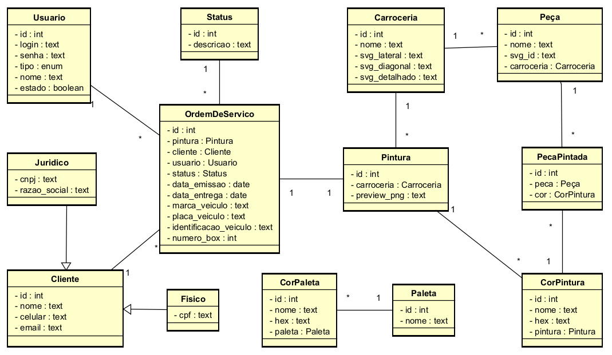
   
  <em>Legenda: Diagrama de Classes normalizado do sistema Bentiviz</em>

---

## 🔄 Fluxo Operacional do Sistema

O ciclo de vida de uma personalização no Bentiviz foi desenhado para ser fluido e seguro, integrando a parte visual à gestão administrativa em um único fluxo contínuo:

### Ciclo de Pintura e Emissão de OS

1.  **Seleção do Modelo:** O usuário inicia o processo escolhendo o modelo de carroceria (ex: Grade Baixa, Graneleira) que servirá como base para a vetorização.
2.  **Personalização Visual:** Através da interface interativa, as cores são aplicadas dinamicamente nos componentes do SVG, permitindo que o cliente visualize o resultado final instantaneamente.
3.  **Registro Contextual:** No momento da persistência, o sistema abre um modal para o cadastro da Ordem de Serviço, garantindo que nenhum dado de pintura seja salvo sem estar devidamente vinculado a um pedido.
4.  **Gestão de Clientes:** Durante a criação da OS, o vendedor pode vincular um cliente já existente ou realizar um novo cadastro sem interromper o fluxo de pintura.
5.  **Finalização e Entrega:** Após o salvamento, a OS fica disponível para consulta na galeria, onde é possível gerar o relatório técnico em PDF para orientar a equipe de pintores no chão de fábrica.

 

|                                1. Seleção                                |                       2. Personalização                       |                            3. Registro OS                             |
| :----------------------------------------------------------------------: | :-----------------------------------------------------------: | :-------------------------------------------------------------------: |
| 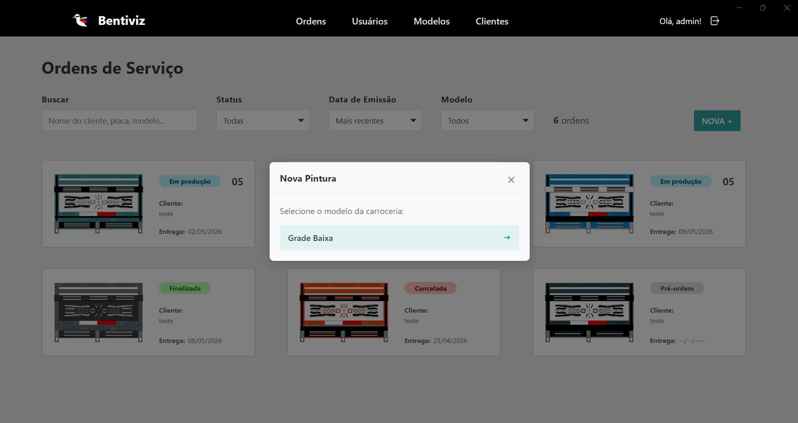 |  | 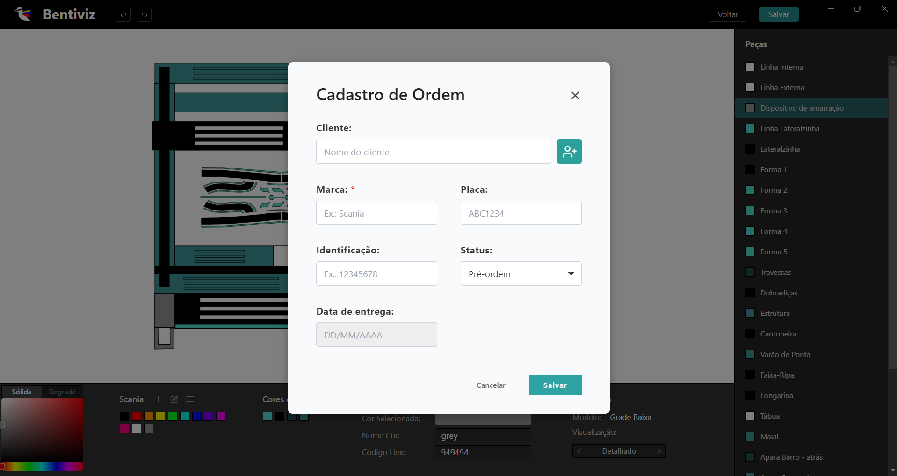 |

 

|                               4. Cliente                               |                            5. Consulta                             |
| :--------------------------------------------------------------------: | :----------------------------------------------------------------: |
| 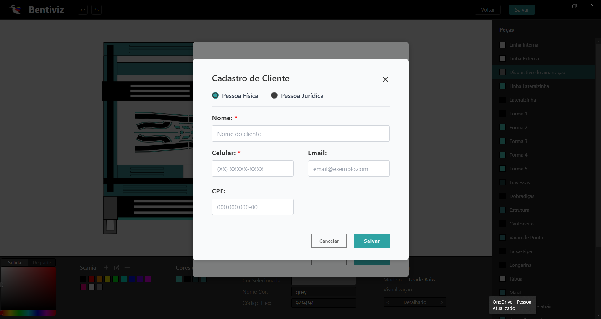 | 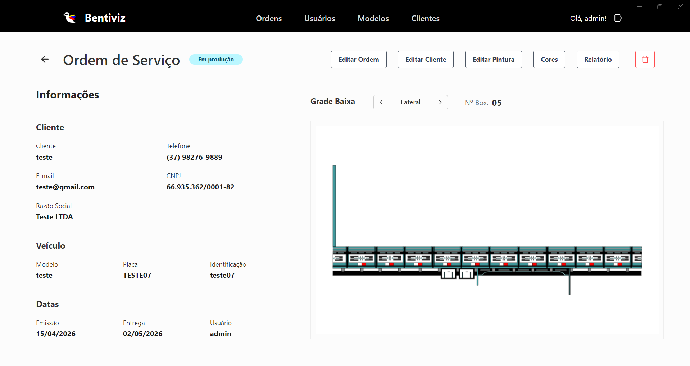 |

 

---

## 🔒 Segurança e Controle de Acesso (RBAC & Hashing)

A arquitetura de segurança do Bentiviz foi projetada para garantir a integridade dos dados e o controle sobre as operações críticas da fábrica.

- **Proteção de Credenciais:** O sistema utiliza a biblioteca `bcrypt` para realizar o hashing das senhas antes da persistência no banco de dados local. Com um fator de custo (salt rounds) de 10, as credenciais permanecem protegidas contra tentativas de extração não autorizada, garantindo que nenhum dado sensível seja armazenado em texto plano.
- **Níveis de Acesso (RBAC):** Foi implementada uma divisão de privilégios para mitigar riscos operacionais:
  - **Usuário Comum:** Acesso às funcionalidades operacionais cruciais para o dia a dia, como a criação de ordens de serviço e a visualização dinâmica das pinturas.
  - **Administrador:** Perfil com acesso total ao sistema para tarefas de gestão, como o cadastro de novos modelos de carrocerias, gerenciamento de peças e exclusão de registros.

---

## 📄 Geração de Artefatos (PDF)

Para integrar o ambiente digital ao fluxo físico no chão de fábrica, o sistema possibilita a criação de relatórios técnicos:

- **Tecnologia e Performance:** Utilização da biblioteca `pdfMake` para a geração dinâmica de documentos.
- **Conteúdo Estruturado:** O relatório consolida os dados da Ordem de Serviço, incluindo as representações visuais dos SVGs pintados e a listagem técnica que relaciona cada componente à sua respectiva cor.
- **Valor para o Negócio:** Esse artefato é passado para a equipe de pintura, eliminando ambiguidades e reduzindo drasticamente o retrabalho causado por falhas de comunicação.

 

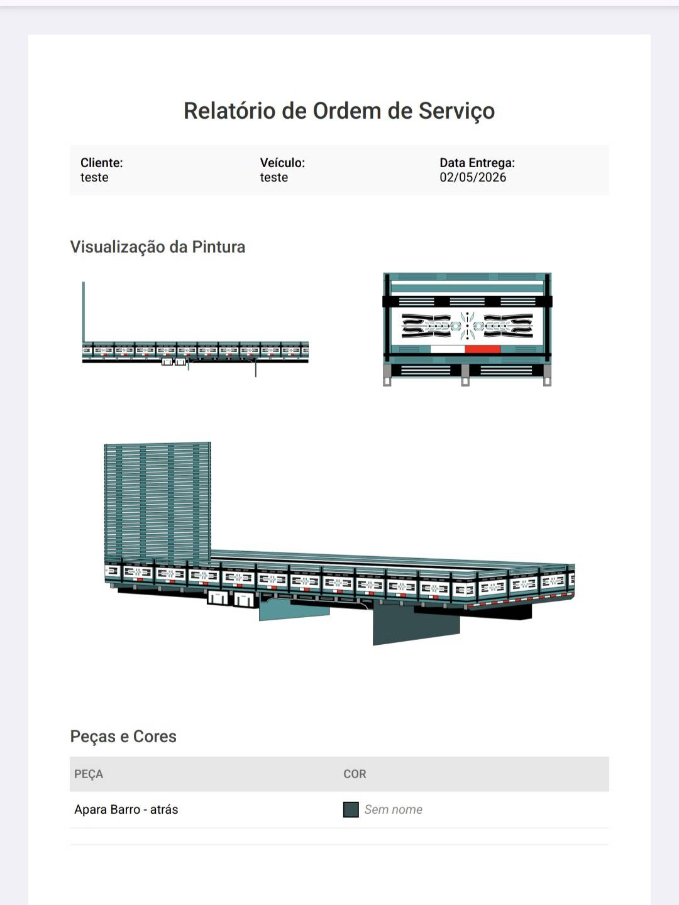

---

## 🧠 Desafios e Aprendizado

O desenvolvimento de uma solução sob medida para o ambiente industrial trouxe desafios que exigiram uma abordagem técnica rigorosa e foco na experiência do usuário.

- **Persistência Transacional e Integridade:** A criação de uma Ordem de Serviço envolvia a persistência simultânea de múltiplas entidades relacionadas, como os dados da OS, cliente, pintura e o mapeamento das peças pintadas. Para evitar estados inconsistentes no banco de dados em caso de falhas, utilizei o recurso de `db.transaction()` do Drizzle ORM sobre o SQLite. Essa implementação garantiu a atomicidade das operações, assegurando que todos os registros fossem salvos com sucesso ou que a operação fosse totalmente revertida.
- **Interoperabilidade entre Design e Código (SVG):** Um dos maiores desafios técnicos foi a ponte entre o design técnico e a manipulação via software. Cada componente da carroceria foi vetorizado manualmente no Inkscape, exigindo uma estrutura de camadas e IDs únicos. Essa organização foi essencial para que a biblioteca Fabric.js pudesse identificar e manipular individualmente cada parte do desenho, permitindo a pintura dinâmica via código.
- **Otimização de Performance (SVG vs. PNG):** Embora o sistema utilize vetores para a edição, renderizar múltiplos SVGs complexos simultaneamente na galeria de ordens comprometeria a fluidez. Como solução de performance, implementei a geração de previews em PNG no ato da criação da ordem, garantindo uma navegação leve e rápida na interface principal.

---

## 🚀 Resultados Obtidos

A implementação do Bentiviz trouxe melhorias diretas para o fluxo operacional da fábrica:

- **Eliminação de Ambiguidades:** Redução drástica de falhas na comunicação entre os setores de vendas, pintura e clientes através de uma especificação visual clara.
- **Validação Antecipada:** Possibilidade de validação visual completa do projeto pelo cliente antes do início da execução física.
- **Rastreabilidade:** Maior controle sobre o histórico e o status de cada ordem de serviço vinculada à produção.
- **Padronização de Processos:** Formalização do fluxo de escolha e registro de cores, evitando a dependência de anotações manuais.
- **Centralização de Dados:** Digitalização integral das informações de pintura, facilitando consultas rápidas e a gestão do portfólio da fábrica.

---

## 🔭 Próximos Passos

O roadmap de evolução do sistema foca em automação, escalabilidade de dados e segurança da informação:

- **Automação de Mapeamento SVG:** Desenvolvimento de uma ferramenta de parsing para identificar IDs automaticamente em arquivos vetoriais, otimizando o cadastro de novos modelos de carroceria.
- **Integração de Catálogos:** Funcionalidade para importação em lote de paletas de cores via arquivos (CSV/JSON) ou através de integração direta com APIs de fabricantes de tintas.
- **Sincronização e Backup em Nuvem:** Implementação de espelhamento de dados para garantir a segurança da informação contra falhas de hardware local.

---

## 🎞️ Galeria e Demonstração

Abaixo, algumas telas adicionais que ilustram os módulos de administração e configuração do sistema:

|             Gestão de Usuários (Admin)              |             Configuração de Paletas              |
| :-------------------------------------------------: | :----------------------------------------------: |
|  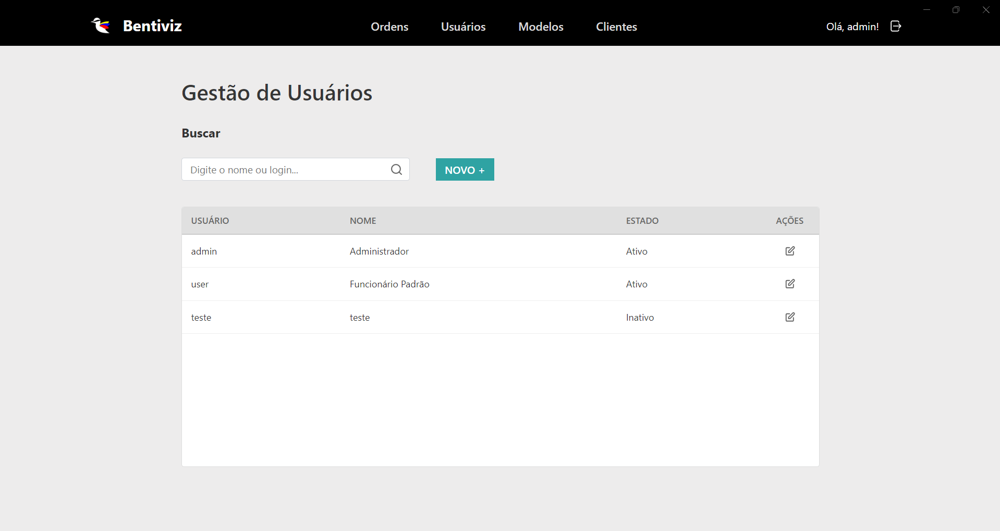  | 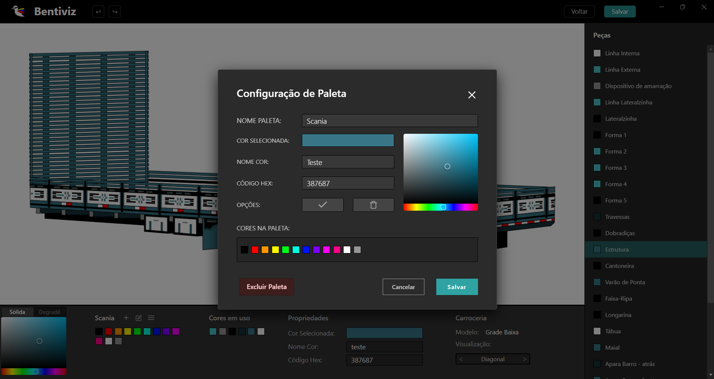  |
| _Painel de controle de acesso (RBAC) e permissões._ | _Módulo de customização dos catálogos de cores._ |

 

|                     Cadastro de Modelos SVG                      |             Lista Técnica de Peças             |
| :--------------------------------------------------------------: | :--------------------------------------------: |
|     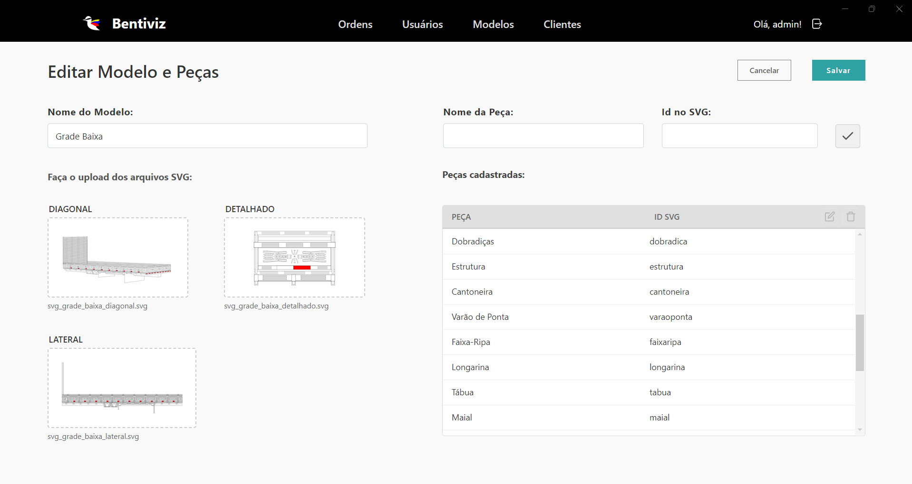     | 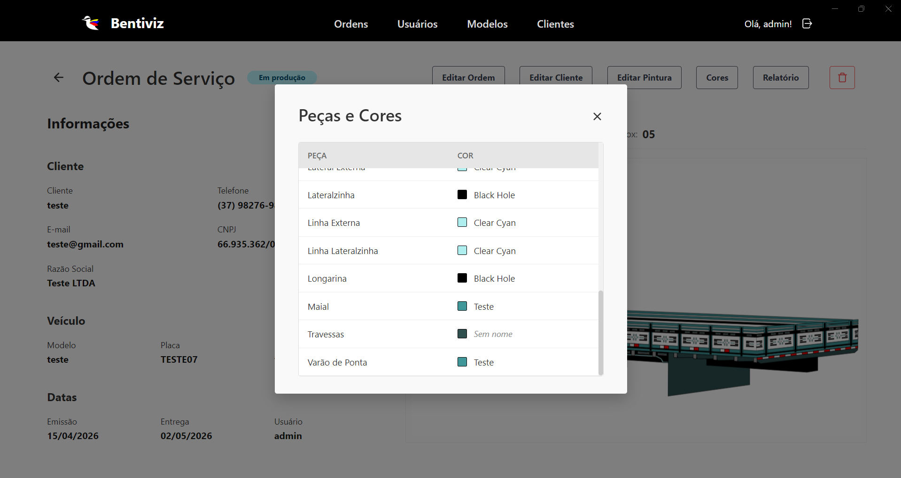 |
| _Interface administrativa para importação de novas carrocerias._ |    _Detalhamento das cores por componente._    |

 

Para uma visualização objetiva, o vídeo abaixo destaca o núcleo operacional do sistema, apresentando o fluxo de pintura dinâmica, a emissão de ordens de serviço e a geração de relatórios técnicos:

https://github.com/user-attachments/assets/75dcbc2f-a53f-4c77-b136-0940fa475e32

 
